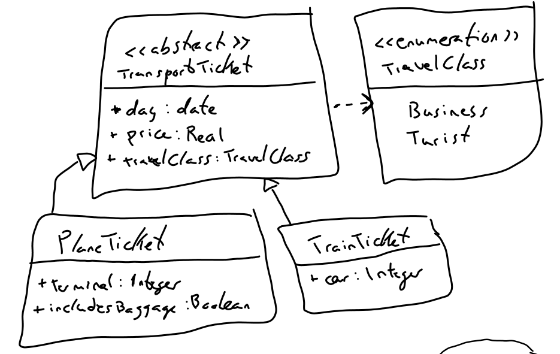
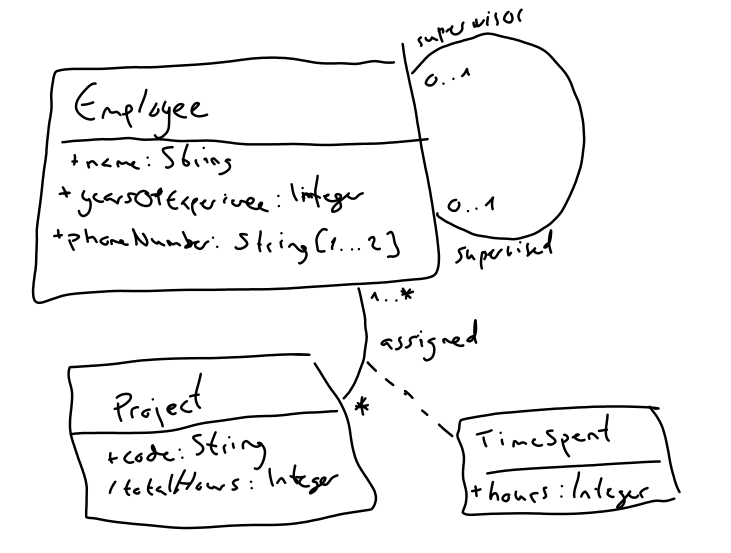
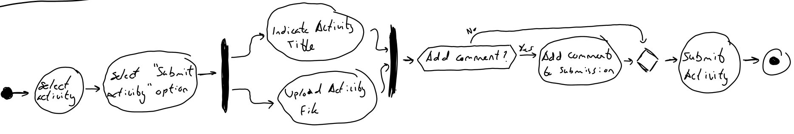
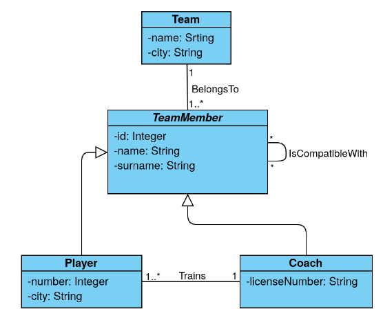
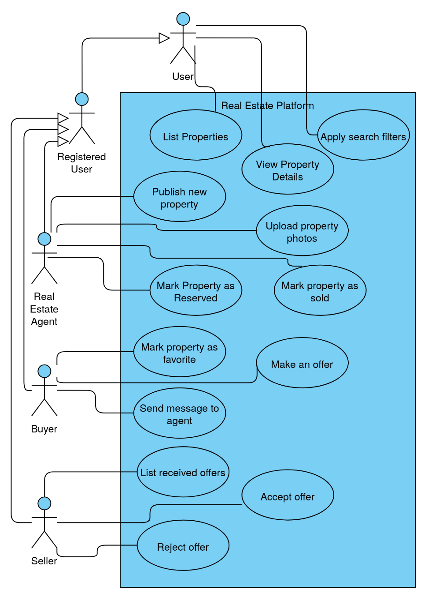
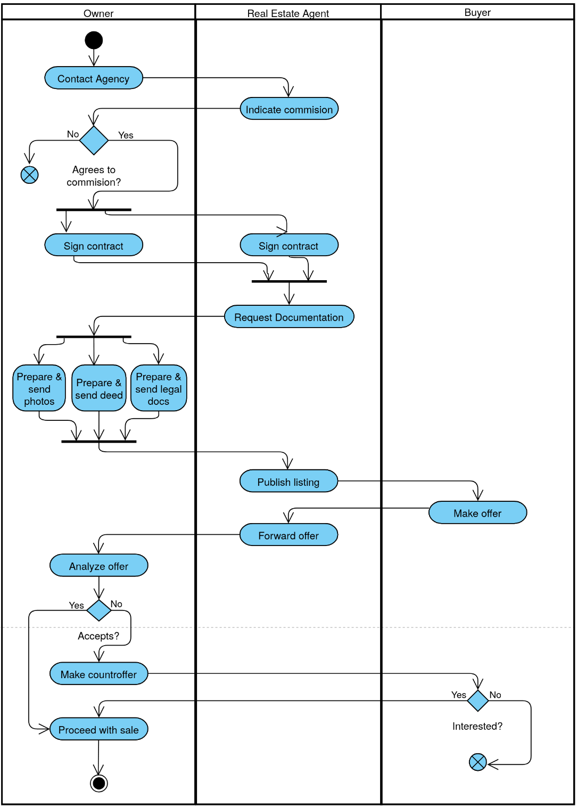
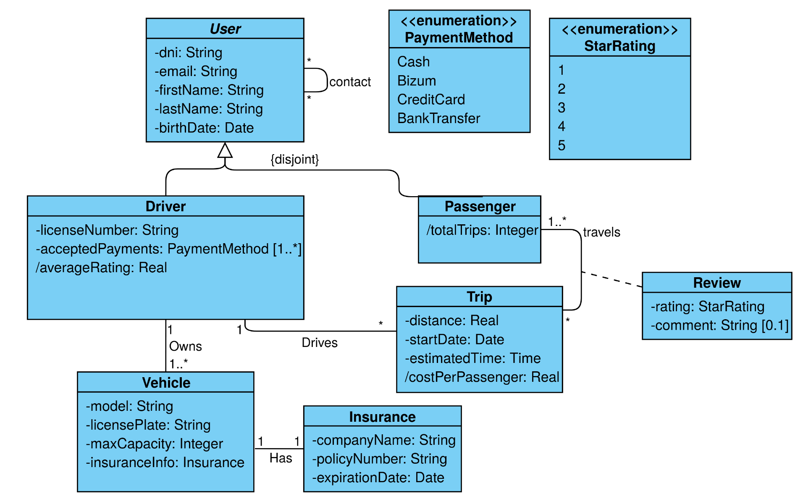

# CAT 2
Alejandro Pérez Bueno
Nov 28, 2025

- [Self-Responsibility Declaration](#self-responsibility-declaration)
- [Question 1](#question-1)
  - [1)](#1)
  - [2)](#2)
  - [3)](#3)
- [Question 2](#question-2)
- [Question 3](#question-3)
- [Question 4](#question-4)
- [Question 6](#question-6)



## Self-Responsibility Declaration

> I understand that plagiarism, the use of AI or other generated content
> will imply that the delivered work will not be reviewed and it will be
> automatically assigned a grade of D. I certify that I have completed
> the CAA2 individually and only with the help that the professors of
> this subject considered appropriate, according to the FAQs about
> plagiarism.



## Question 1

### 1)

### 2)

### 3)

## Question 2

## Question 3

## Question 4

## Question 6

