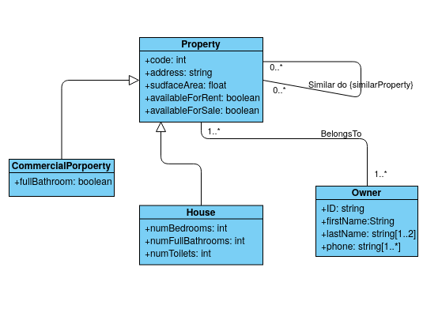
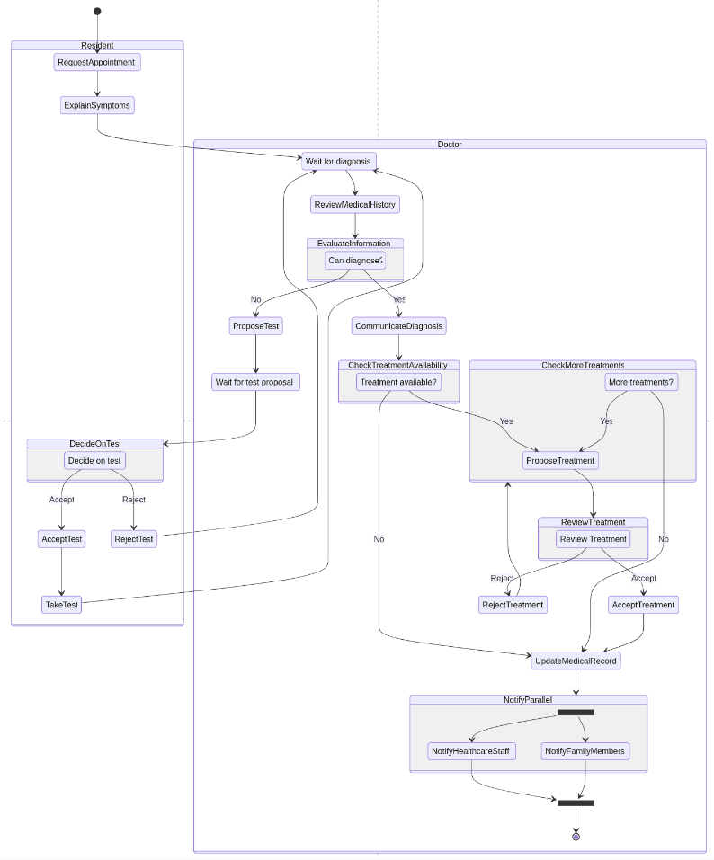

# CAT 2
Alejandro Pérez Bueno
May 10, 2024

-   [Self-Responsibility Declaration](#self-responsibility-declaration)
-   [Question 1](#question-1)
    -   [1) `RealEstateProperty`](#realestateproperty)
    -   [2) `FitnessExercise`](#fitnessexercise)
    -   [3) Swimlanes diagram](#swimlanes-diagram)
-   [Question 2](#question-2)
-   [Question 3](#question-3)
-   [Question 4](#question-4)
    -   [a)](#a)
    -   [b)](#b)
-   [Question 5](#question-5)
-   [Question 6](#question-6)
    -   [a)](#a-1)
    -   [b)](#b-1)



## Self-Responsibility Declaration

> I understand that plagiarism, the use of AI or other generated content
> will imply that the delivered work will not be reviewed and it will be
> automatically assigned a grade of D. I certify that I have completed
> the CAT2 individually and only with the help that the professors of
> this subject considered appropriate, according to the FAQs about
> plagiarism.



## Question 1

### 1) `RealEstateProperty`

<figure>

<figcaption aria-hidden="true">Class Diagram</figcaption>
</figure>

### 2) `FitnessExercise`

<figure>

<figcaption aria-hidden="true">Class Diagram</figcaption>
</figure>

### 3) Swimlanes diagram

<figure>

<figcaption aria-hidden="true">Activity Diagram</figcaption>
</figure>



## Question 2

> **Note**
>
> All diagrams have been created with [PlantUML](https://plantuml.com/),
> a tool used to generate UML diagrams from plaintext.

For this exercise, here is the code that generates the class diagram:

<figure>

<figcaption aria-hidden="true">Class Diagram</figcaption>
</figure>

## Question 3

<figure>

<figcaption aria-hidden="true">Use Case Diagram</figcaption>
</figure>

## Question 4

### a)

<figure>

<figcaption aria-hidden="true">Class Diagram</figcaption>
</figure>

### b)

-   Restrictions:
    -   Usernames and email addresses are distinct for every user,
        excluding repetitiveness.
    -   Each term retains a unique name, avoiding any duplication.
-   Integrity constraints:
    -   A profile image, once linked to a user, remains exclusive to
        that user.
    -   Every piece of content has a single author, preventing multiple
        authorship.
    -   Only after a piece of content is created can comments be made,
        ensuring chronological integrity.
    -   Each piece of content is associated with at least one category,
        and can have many, or no tags, ensuring the flexibility of
        content association.
-   Other considerations:
    -   Content status is inferred from the creation and publication
        dates. If not published, content is either in Draft or
        PendingReview status. If published, status is Series.
    -   Replies to comments are tracked from associated comments with
        content. Any reply is registered under the original comment.
    -   The attached terms with content are derived from terms assigned
        to the same.

## Question 5

<figure>

<figcaption aria-hidden="true">Activity Diagram</figcaption>
</figure>

## Question 6

### a)

<figure>

<figcaption aria-hidden="true">Class Diagram</figcaption>
</figure>

### b)

-   Restrictions:
    -   Each product has a unique reference number.
    -   The price of a product should be non-negative. If it’s zero,
        meaning the product is free, it cannot have a discount.
-   Integrity Constraints:
    -   Each order is placed by a single customer and can contain one or
        more products. An order can’t exist without a customer.
    -   A user can be a customer, meaning a user can place orders.
    -   Data about each product’s type - physical or digital - is
        maintained. Weight and shipping cost are associated with
        physical products while a URL and max downloads are tracked for
        digital products.
-   Other considerations:
    -   The total amount of each order, in terms of cost, is derived by
        the aggregation of subtotals of individual products in the
        order, the result of multiplying the number of units by the
        price of the product.
    -   The available inventory can be indirectly tracked by assaying
        the count of each product reference in all orders.
