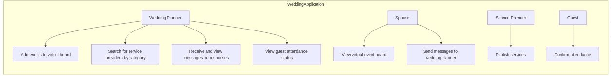
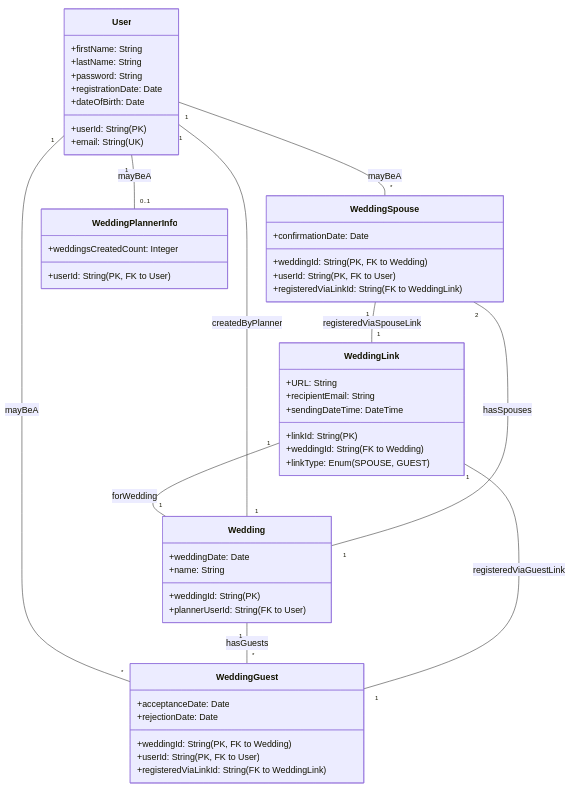

# PRAC 2
Alejandro Pérez Bueno
May 16, 2025

- [Self-Responsibility Declaration](#self-responsibility-declaration)
- [Question 1](#question-1)
- [Question 2](#question-2)
  - [Additional User-Level Use Cases](#additional-user-level-use-cases)
  - [UML Use Case Diagram:](#uml-use-case-diagram)
- [Question 3](#question-3)
- [Question 4](#question-4)
  - [Listing Class Relationships](#listing-class-relationships)
  - [Defining Derived Information](#defining-derived-information)
- [Defining New Attributes](#defining-new-attributes)
  - [Finalizing Attribute Details](#finalizing-attribute-details)
  - [Reconsidering Implementation
    Details](#reconsidering-implementation-details)
- [Question 5](#question-5)



## Self-Responsibility Declaration

> I certify that I have carried out Practice 2 completely individually
> and only with the help that the teaching staff of this subject
> considers appropriate, according to the instructions explained in the
> “Originality in the evaluation” section of the classroom. I understand
> that non-original work and/or the use of generative AI will mean that
> the submitted activity will not be corrected and will automatically be
> assigned a grade of 0.



## Question 1

## Question 2

### Additional User-Level Use Cases

1.  **As a wedding planner, I want to be able to add events to a virtual
    board so that the couple can have an overview of how their wedding
    will be.**
    - Derived use case: **As a spouse, I want to view the virtual event
      board.**
2.  **As a service provider, I want to be able to publish my services in
    the corresponding category so that both wedding planners and couples
    can hire them.**
    - Derived use case: **As a wedding planner, I want to search for
      service providers by category.** *(Alternatively: As a spouse, I
      want to browse services offered by providers.)*
3.  **As a spouse, I want to be able to send messages to the wedding
    planner to communicate with them directly.**
    - Derived use case: **As a wedding planner, I want to receive and
      view messages from spouses.**
4.  **As a guest, I want to be able to confirm my attendance at the
    wedding through the application so that they can count on our
    attendance.**
    - Derived use case: **As a wedding planner, I want to view the guest
      attendance status.**

### UML Use Case Diagram:

## Question 3

**Domain Classes and Keys:**

1.  **User**
    - **Primary Key (PK):** `userId` (A system-generated unique
      identifier for each user).
    - **Unique Key (UK):** `email` (The problem states email must be
      unique for each user).
2.  **Wedding**
    - **Primary Key (PK):** `weddingId` (A system-generated unique
      identifier for each wedding).
    - **Foreign Key (FK):** `plannerUserId` (references `User.userId` to
      identify the wedding planner who created the wedding).
3.  **WeddingLink**
    - **Primary Key (PK):** `linkId` (A system-generated unique
      identifier for each link).
    - **Foreign Key (FK):** `weddingId` (references `Wedding.weddingId`
      to associate the link with a specific wedding).
    - **Attributes:** `URL`, `recipientEmail`, `sendingDateTime`,
      `linkType` (Enumerated: ‘SPOUSE’, ‘GUEST’).
4.  **WeddingSpouse** (This class links a User to a Wedding as a spouse)
    - **Composite Primary Key (PK):** (`weddingId`, `userId`)
      - `weddingId` (FK to `Wedding.weddingId`)
      - `userId` (FK to `User.userId`)
    - **Foreign Key (FK):** `registeredViaLinkId` (references
      `WeddingLink.linkId`, indicating the specific spouse link used for
      registration).
    - **Attributes:** `confirmationDate`.
5.  **WeddingGuest** (This class links a User to a Wedding as a guest)
    - **Composite Primary Key (PK):** (`weddingId`, `userId`)
      - `weddingId` (FK to `Wedding.weddingId`)
      - `userId` (FK to `User.userId`)
    - **Foreign Key (FK):** `registeredViaLinkId` (references
      `WeddingLink.linkId`, indicating the specific guest invitation
      link used for registration).
    - **Attributes:** `acceptanceDate` (nullable), `rejectionDate`
      (nullable).
6.  **WeddingPlannerInfo** (This class stores information specific to a
    User acting as a Wedding Planner)
    - **Primary Key (PK) & Foreign Key (FK):** `userId` (references
      `User.userId`).
    - **Attributes:** `weddingsCreatedCount`.

**Textual Integrity Constraints:**

1.  **User Email Uniqueness:** The `email` attribute in the `User` class
    must be unique across all user records.
2.  **Spouse Links per Wedding:** For each `Wedding` record, there must
    be exactly two `WeddingLink` records where `linkType` is ‘SPOUSE’.
3.  **Guest Link Generation Condition:** `WeddingLink` records with
    `linkType = 'GUEST'` for a specific wedding are only sent (or made
    active) once both `WeddingSpouse` entries for that `Wedding` have
    their `confirmationDate` set.
4.  **Spouse Confirmation:** The `confirmationDate` in the
    `WeddingSpouse` table is set when the specific user (spouse)
    accesses the system for the first time via their designated ‘SPOUSE’
    `WeddingLink` and confirms the wedding details.
5.  **Guest Invitation Response:** For each `WeddingGuest` entry:
    - If `acceptanceDate` is set, `rejectionDate` must be null.
    - If `rejectionDate` is set, `acceptanceDate` must be null.
    - It’s possible for both to be null if the guest has not yet
      responded.
6.  **Link Registration:**
    - Each `WeddingSpouse` record must have a `registeredViaLinkId` that
      references a `WeddingLink` record with `linkType = 'SPOUSE'` and
      the corresponding `weddingId`.
    - Each `WeddingGuest` record must have a `registeredViaLinkId` that
      references a `WeddingLink` record with `linkType = 'GUEST'` and
      the corresponding `weddingId`.
7.  **User Role Flexibility:** A `User` can simultaneously:
    - Be associated with a `WeddingPlannerInfo` record (if they are a
      wedding planner).
    - Be associated with multiple `WeddingSpouse` records (being a
      spouse in multiple different weddings).
    - Be associated with multiple `WeddingGuest` records (being a guest
      at multiple different weddings).
8.  **Wedding Planner Association:** Each `Wedding` must have a
    `plannerUserId` that validly references a `User` who is designated
    or can act as a wedding planner (implicitly, this user might have an
    entry in `WeddingPlannerInfo`, or the system might check a role flag
    on the User model if `WeddingPlannerInfo` wasn’t used for other
    planner-specific data).
9.  **Direct Access from Wedding to Spouses/Guests:**
    - The system must allow querying from a `Wedding` to retrieve all
      associated `User` records linked through `WeddingSpouse` (the
      spouses of that wedding).
    - The system must allow querying from a `Wedding` to retrieve all
      associated `User` records linked through `WeddingGuest` (the
      guests of that wedding).
10. **WeddingSpouse Cardinality:** Each `Wedding` is associated with
    exactly two `WeddingSpouse` entries (and thus two users acting as
    spouses for that wedding).

**Derived Information:**

1.  **`WeddingPlannerInfo.weddingsCreatedCount`:** This integer value is
    derived. It is the count of all `Wedding` records where the
    `Wedding.plannerUserId` matches the `WeddingPlannerInfo.userId`.
    This count should be updated whenever a wedding planner creates a
    new wedding.

## Question 4

Examining Feature Expansion

Okay, so I’m adding a “virtual wedding board.” First, I need to nail
down the new classes. I’ve got `VirtualBoard`, `BoardContent` (and
specializations), `Message`, and `EventStateTransition`. Now I need to
figure out their attributes and how they relate to what I’ve already
defined.

### Listing Class Relationships

Okay, I’ve got the new classes and their core attributes down. Now I
need to map the relationships between them. `VirtualBoard` is linked to
`Wedding`, and `BoardContent` links to `VirtualBoard`. `Announcement`
and `Event` are specializations of `BoardContent`. Then, there are
`Message` to `Event` and `Message` (self-referential for threading) and
`EventStateTransition` to `Event` and `User`.

### Defining Derived Information

Okay, I’ve got the relationships and key attributes sorted. Next, I need
to figure out what information can be derived from the new model. For
example, the number of messages per event, or the overall status of the
wedding based on the event states.

## Defining New Attributes

Okay, I’ve detailed the attributes for each new class, including foreign
keys and the necessary constraints. I’m focusing on the integrity
constraints to keep the data clean. Now, I can start thinking about the
Mermaid.js diagram.

### Finalizing Attribute Details

I’ve reviewed the new attributes and key constraints, including foreign
keys and enums. I’ve also thought through derived information, like the
board name and the default announcement order. Now, it’s time to update
the Mermaid.js diagram, reflecting the changes and any additions.

Thinking Over Implementation Details

Okay, I’ve got all the classes, attributes, relationships, and
constraints outlined. I’ve also identified the derived information and
the necessary changes to the existing model. Now I need to make a quick
run through the constraints again.

Refining Details & Constraints

I’ve reviewed the attributes and constraints, especially the
relationship between announcements and weddings. The plan is to make
`BoardContent` an abstract class. The diagram and data integrity are now
the primary concerns. Now, I will define the Mermaid.js diagram.

### Reconsidering Implementation Details

I’m re-examining the relationships to ensure they’re correctly
represented in the diagram. Also, thinking through the implications of
using an abstract `BoardContent` class.

Reflecting & Re-examining

I’m still going through the attribute details and constraints. I want to
ensure the relationships are clear and that the data integrity is
maintained, including the inheritance. I’ll keep the `BoardContent`
abstract, and update the diagram accordingly.

Okay, let’s extend the model to include the virtual wedding board,
announcements, and events.

**a) UML Class Diagram**

Here is the updated UML class diagram incorporating the new features.

**Changes compared to the last exercise:**

- The classes defined in the previous exercise (`User`, `Wedding`,
  `WeddingLink`, `WeddingSpouse`, `WeddingGuest`, `WeddingPlannerInfo`)
  are all retained as the foundation.
- **New Classes Added:**
  - `VirtualBoard`: Represents the wedding board itself.
  - `BoardContent`: An abstract base class for items on the board.
  - `Announcement`: A specific type of board content for textual
    announcements.
  - `Event`: A specific type of board content for wedding-related
    events.
  - `Message`: Represents messages in the discussion thread of an event.
  - `EventStateTransition`: Records the history of states an event goes
    through.
- **New Relationships:** These new classes are linked to each other and
  to existing classes like `Wedding` and `User`. For instance, a
  `Wedding` now has one `VirtualBoard`, and `User`s can create
  `Announcement`s and `Message`s.

**b) Keys of the domain classes and other textual integrity
constraints**

**Keys for New Domain Classes:**

1.  **VirtualBoard**
    - **Primary Key (PK):** `boardId` (Unique identifier for the board).
    - **Foreign Key (FK) & Unique Key (UK):** `weddingId` (references
      `Wedding.weddingId`, ensuring one board per wedding).
2.  **BoardContent** (Abstract class, keys apply to its concrete
    specializations)
    - **Primary Key (PK):** `contentId` (Unique identifier for any piece
      of board content).
    - **Foreign Key (FK):** `boardId` (references
      `VirtualBoard.boardId`).
3.  **Announcement** (inherits `contentId` as PK and `boardId` as FK
    from `BoardContent`)
    - **Foreign Key (FK):** `creatorUserId` (references `User.userId`).
    - **Foreign Key (FK):** `previousAnnouncementId` (nullable,
      references `Announcement.contentId` of the preceding
      announcement).
    - **Foreign Key (FK):** `nextAnnouncementId` (nullable, references
      `Announcement.contentId` of the subsequent announcement).
4.  **Event** (inherits `contentId` as PK and `boardId` as FK from
    `BoardContent`)
    - No additional explicit foreign keys in the class itself besides
      those inherited, but it’s linked to `Message` and
      `EventStateTransition`.
5.  **Message**
    - **Primary Key (PK):** `messageId` (Unique identifier for the
      message).
    - **Foreign Key (FK):** `eventId` (references `Event.contentId`).
    - **Foreign Key (FK):** `authorUserId` (references `User.userId`).
    - **Foreign Key (FK):** `repliedToMessageId` (nullable, references
      `Message.messageId` for threaded replies).
6.  **EventStateTransition**
    - **Primary Key (PK):** `transitionId` (Unique identifier for the
      state change record).
    - **Foreign Key (FK):** `eventId` (references `Event.contentId`).

**Textual Integrity Constraints (for new features):**

1.  **VirtualBoard Creation:** A `VirtualBoard` is created when a
    `Wedding` is created. There is a one-to-one relationship between
    `Wedding` and `VirtualBoard`.
2.  **VirtualBoard Name:** The `VirtualBoard.name` attribute always
    takes the same value as the `Wedding.name` of the associated wedding
    at the time of board creation.
3.  **Announcement Creator:** The `creatorUserId` for an `Announcement`
    must be a `User` directly related to the `Wedding` (i.e., the
    wedding planner, one of the spouses, or an accepted guest associated
    with the `VirtualBoard`’s `weddingId`).
4.  **Announcement Order:**
    - Announcements have a specific order. `previousAnnouncementId` and
      `nextAnnouncementId` manage this doubly linked list.
    - For the first announcement on a board, `previousAnnouncementId` is
      null.
    - For the last announcement on a board, `nextAnnouncementId` is
      null.
    - A new `Announcement` is, by default, added as the last in the
      order (its `previousAnnouncementId` points to the formerly last
      announcement, and its `nextAnnouncementId` is null; the formerly
      last announcement’s `nextAnnouncementId` is updated).
5.  **Event States:**
    - `Event.currentState` must be one of ‘PROPOSED’, ‘ACCEPTED’, or
      ‘REJECTED’.
    - `Event.acceptanceDate` can only be set if `currentState` is
      ‘ACCEPTED’. If set, `rejectionReason` must be null.
    - `Event.rejectionReason` can only be set if `currentState` is
      ‘REJECTED’. If set, `acceptanceDate` must be null.
6.  **Message Author:** The `authorUserId` for a `Message` associated
    with an `Event` can only be one of the spouses involved in the
    `Wedding` or the `WeddingPlannerInfo.userId` who created the
    `Wedding` (essentially, the wedding planner or the spouses of the
    wedding to which the event belongs).
7.  **Message Reply:** `Message.repliedToMessageId`, if not null, must
    reference a valid `Message.messageId` belonging to the same `Event`.
8.  **Event State Transition History:**
    - For each `Event`, there will be one or more `EventStateTransition`
      records.
    - The `state` in `EventStateTransition` must be one of ‘PROPOSED’,
      ‘ACCEPTED’, or ‘REJECTED’.
    - The `EventStateTransition` records for a given event must be
      ordered (e.g., by `transitionDateTime` or an `orderIndex`) to
      reflect the sequence in which states occurred.
    - The first state transition for any event will be to ‘PROPOSED’.
9.  **Board Content Visibility:** The `isVisibleToGuests` flag on
    `BoardContent` (and thus on `Announcement` and `Event`) determines
    if general guests can see that item.

**Derived Information (for new features):**

1.  **`Event.currentState`**: While stored explicitly for direct access,
    this value is also inherently the `state` of the most recent
    `EventStateTransition` record (based on `transitionDateTime` or
    `orderIndex`) for that particular `Event`.
2.  **Order of Announcements (Implicit):** The position of an
    announcement (e.g., “3rd announcement”) is derived by traversing the
    linked list (`previousAnnouncementId`/`nextAnnouncementId`) or by
    its `orderIndex` if that approach was chosen (the diagram uses
    linked list fields). The “last in order” for a new announcement is
    derived by finding the current announcement with a null
    `nextAnnouncementId`.

## Question 5

**a) UML Class Diagram of the Analysis Model**

**Changes compared to the last exercise:**

- The classes defined in previous exercises (like `User`, `Wedding`,
  `Event`, etc.) are considered part of the overall model, but for this
  diagram, we will only explicitly detail the *new* classes and show
  connections to relevant existing classes (`User`, `Event`) without
  restating all their previous attributes, as per your request.
- **New User Role:** `ProviderManager` is introduced as a specific type
  of user. Similar to `WeddingPlannerInfo`, we can model this as
  `ProviderManagerInfo` linked to the `User` class.
- **New Core Classes Added:**
  - `Provider`: Represents the service provider company/entity.
  - `Category`: Represents categories for providers and services.
  - `Service`: Represents a specific service offered by a provider.
  - `ServiceContract`: Represents the agreement when a service is hired
    for a wedding event.
- **New Join Table:**
  - `ProviderCategory`: To manage the many-to-many relationship between
    `Provider` and `Category`.
- **New Relationships:** These new classes are interrelated and also
  connect to existing classes like `User` (for Provider Managers) and
  `Event` (for which services are contracted).

**b) Keys of the domain classes and other textual integrity
constraints**

**Keys for New Domain Classes:**

1.  **ProviderManagerInfo**
    - **Primary Key (PK) & Foreign Key (FK):** `userId` (references
      `User.userId`).
    - **Foreign Key (FK):** `managesProviderId` (references
      `Provider.providerId`).
2.  **Provider**
    - **Primary Key (PK):** `providerId` (Unique identifier for the
      provider).
    - **Unique Key (UK):** `name` (The provider’s name must be unique).
3.  **Category**
    - **Primary Key (PK):** `categoryId` (Unique identifier for the
      category).
    - **Unique Key (UK):** `name` (The category name must be unique).
4.  **ProviderCategory** (Join table for the many-to-many relationship
    between Provider and Category)
    - **Composite Primary Key (PK):** (`providerId`, `categoryId`)
      - `providerId` (FK to `Provider.providerId`)
      - `categoryId` (FK to `Category.categoryId`)
5.  **Service**
    - **Primary Key (PK):** `serviceId` (Unique identifier for the
      service).
    - **Foreign Key (FK):** `providerId` (references
      `Provider.providerId`, indicating which provider offers this
      service).
    - **Foreign Key (FK):** `categoryId` (references
      `Category.categoryId`, indicating the category of this service).
6.  **ServiceContract**
    - **Primary Key (PK):** `contractId` (Unique identifier for the
      service contract).
    - **Foreign Key (FK):** `eventId` (references `Event.contentId` from
      the Virtual Board’s Event).
    - **Foreign Key (FK):** `serviceId` (references
      `Service.serviceId`).

**Textual Integrity Constraints (for new features):**

1.  **Provider Manager - Provider Link:** Each `ProviderManagerInfo`
    record (representing a provider manager user) must be linked to
    exactly one `Provider` (via `managesProviderId`). A `Provider` can
    be managed by multiple `ProviderManagerInfo` records.
2.  **Provider Name Uniqueness:** The `name` of each `Provider` must be
    unique within the system.
3.  **Category Name Uniqueness:** The `name` of each `Category` must be
    unique.
4.  **Service Category Constraint:** The `Service.categoryId` must
    reference a `Category` that the `Service.providerId` is also
    associated with (i.e., there must be a corresponding entry in the
    `ProviderCategory` table for the service’s provider and the
    service’s category).
5.  **Service Cost Type:** The `Service.costType` must clearly indicate
    if the `Service.costAmount` is a ‘FIXED’ cost or a ‘PER_PERSON’
    cost.
6.  **Service Contract - Number of People:** The `numberOfPeople` in a
    `ServiceContract` is relevant especially when the `Service.costType`
    is ‘PER_PERSON’.
7.  **Service Contract - Discount:** The `discountPercentage` in
    `ServiceContract` is optional. If not provided, it’s assumed to be
    0.

**Derived Information (for new features):**

1.  **`ServiceContract.calculatedTotalCost` (Float):**
    - This value is calculated based on the linked `Service` and the
      `ServiceContract.numberOfPeople`.
    - If `Service.costType` is ‘FIXED’:
      `calculatedTotalCost = Service.costAmount`.
    - If `Service.costType` is ‘PER_PERSON’:
      `calculatedTotalCost = Service.costAmount * ServiceContract.numberOfPeople`.
2.  **`ServiceContract.calculatedFinalCost` (Float):**
    - This value is calculated from the `calculatedTotalCost` and the
      `ServiceContract.discountPercentage`.
    - `calculatedFinalCost = calculatedTotalCost - (calculatedTotalCost * (discountPercentage / 100.0))`
    - If `discountPercentage` is null or 0, then
      `calculatedFinalCost = calculatedTotalCost`.
