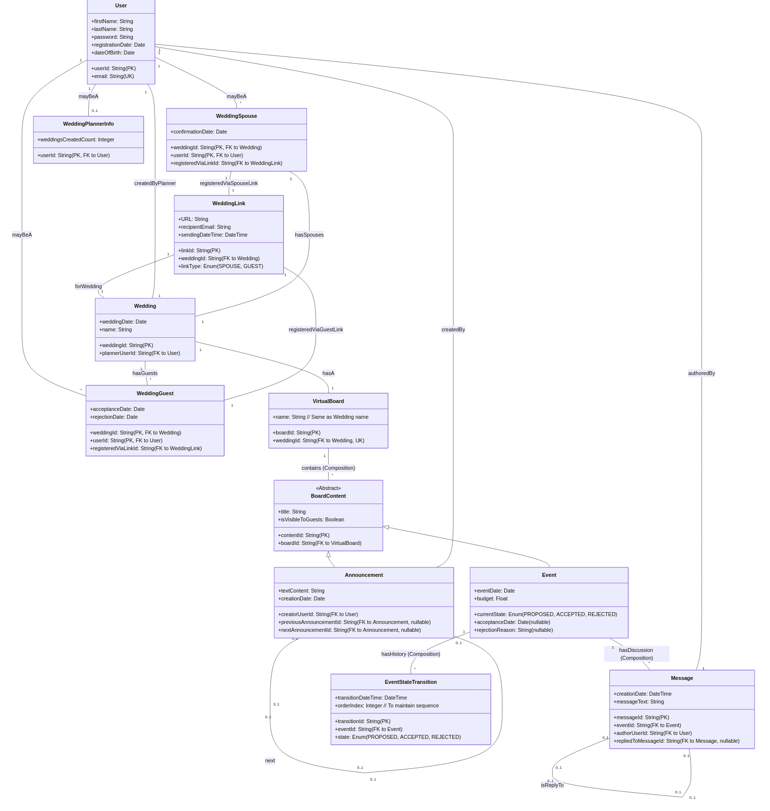
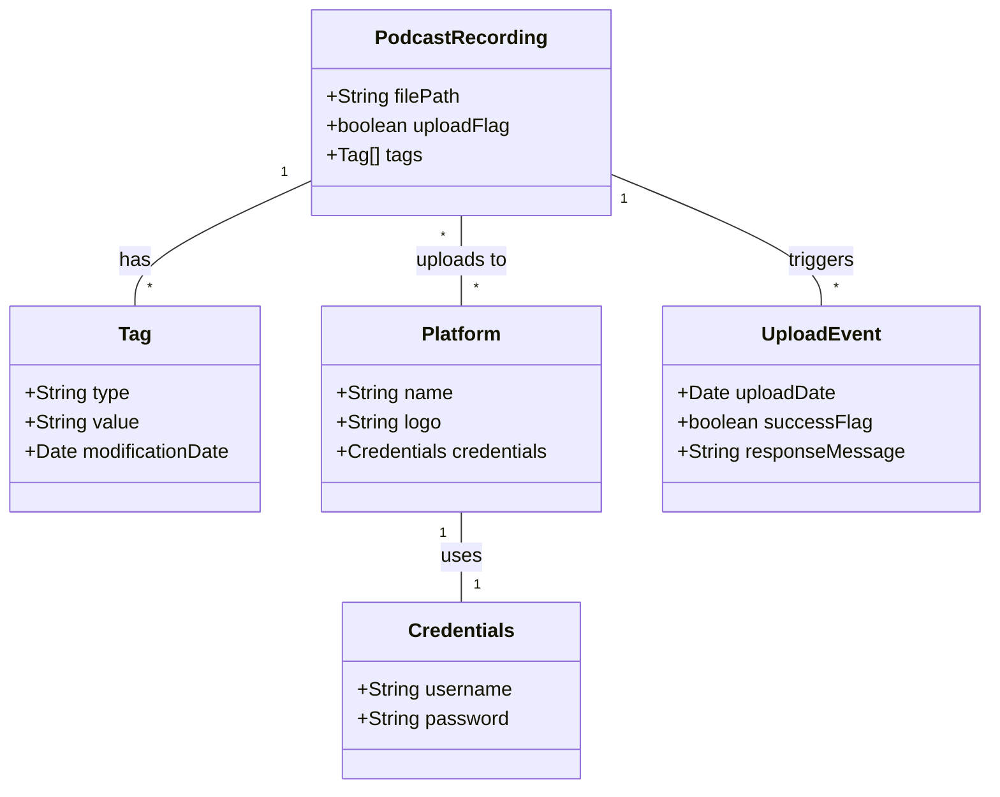

# PRAC 2
Alejandro Pérez Bueno
May 31, 2024

- [Self-Responsibility Declaration](#self-responsibility-declaration)
- [Question 1](#question-1)
- [Question 2](#question-2)
  - [Additional Use Case](#additional-use-case)
  - [Use Case Diagrams](#use-case-diagrams)
- [Question 3](#question-3)
  - [Class Diagram](#class-diagram)
  - [Explanation](#explanation)
- [Question 4](#question-4)
  - [Class Diagram](#class-diagram-1)
  - [Explanation](#explanation-1)
- [Question 5](#question-5)
  - [Class Diagram](#class-diagram-2)
  - [Explanation](#explanation-2)



## Self-Responsibility Declaration

> I understand that plagiarism, the use of AI or other generated content
> will imply that the delivered work will not be reviewed and it will be
> automatically assigned a grade of D. I certify that I have completed
> the PRAC2 individually and only with the help that the professors of
> this subject considered appropriate, according to the FAQs about
> plagiarism.

> [!TIP]
>
> All diagrams from this practice have been generated using
> [mermaid.js](https://mermaid.js.org/) or
> [plantuml](https://plantuml.com/).



## Question 1

## Question 2

### Additional Use Case

#### Global Administrator

**Use Case Identifier:** Define Minimum Rental Price for Studios

**Main Actor:** Global Administrator

**Supporting Actors:** None

**Level:** Strategic

**Scope:** Organization

**Main Success Scenario:**

1.  The global administrator accesses the platform.
2.  The global administrator navigates to the pricing management
    section.
3.  The global administrator selects the option to define minimum rental
    prices.
4.  The global administrator inputs the minimum prices for different
    studio sizes.
5.  The global administrator saves the changes.
6.  The system confirms the changes.
7.  The use case ends.

**Alternative Scenarios:**

4a. The input prices are below the allowed minimum. 4a1. The system
displays an error message. 4a2. The use case returns to step 4.

#### Local Administrator

**Use Case Identifier:** Manage Studio Availability

**Main Actor:** Local Administrator

**Supporting Actors:** None

**Level:** Operational

**Scope:** Local Radio Station

**Main Success Scenario:**

1.  The local administrator logs into the platform.
2.  The local administrator navigates to the studio management section.
3.  The local administrator updates the availability of studios,
    including enabling or disabling specific studios.
4.  The local administrator updates the time slots for each studio.
5.  The local administrator applies a margin to the rental price.
6.  The local administrator saves the changes.
7.  The system confirms the updates.
8.  The use case ends.

**Alternative Scenarios:**

3a. No changes are made to the studio availability.

3a1. The local administrator exits without saving.

3a2. The use case ends.

#### Technician

**Use Case Identifier:** Register as an Independent Technician

**Main Actor:** Technician

**Supporting Actors:** None

**Level:** Operational

**Scope:** Platform

**Main Success Scenario:**

1.  The technician accesses the platform.
2.  The technician navigates to the registration section.
3.  The technician fills out the registration form with personal
    details, qualifications, and availability.
4.  The technician submits the registration form.
5.  The system validates the information and confirms the registration.
6.  The use case ends.

**Alternative Scenarios:**

4a. The information is incomplete or incorrect.

4a1. The system displays an error message.

4a2. The use case returns to step 3.

#### Anonymous User

**Use Case Identifier:** Browse Available Studios

**Main Actor:** Anonymous User

**Supporting Actors:** None

**Level:** Informational

**Scope:** Platform

**Main Success Scenario:**

1.  The anonymous user accesses the platform.
2.  The anonymous user navigates to the browse section.
3.  The anonymous user selects a date and time to check studio
    availability.
4.  The system displays available studios for the selected time.
5.  The use case ends.

**Alternative Scenarios:**

4a. No studios are available for the selected time.

4a1. The system informs the user.

4a2. The use case ends.

### Use Case Diagrams

## Question 3

### Class Diagram

### Explanation

1.  **Keys:**
    - **Radio**: The key for the Radio class is the `name` attribute,
      which is unique.
    - **Studio**: The key for the Studio class is the `name` attribute,
      which is unique within the context of a Radio station.
2.  **Textual Integrity Constraints:**
    - **Radio**: Each Radio must have at least one associated Frequency,
      which is identified by its unique combination of frequency value,
      type (FM or AM), and description.
    - **StudioModel**: Each StudioModel is uniquely identified by its
      `size`. No two models can refer to the same size.
    - **Frequency**: The primary frequency for each Radio station is
      mandatory, ensuring that each Radio has at least one Frequency
      marked as primary.
3.  **Derived Information:**
    - **Studio Final Price**: The final price of a Studio is derived
      from the base price defined in the StudioModel plus an optional
      price margin specified by the Radio station when defining a
      Studio. This allows for the calculation of the final price which
      is stored and used for transactions.

## Question 4

### Class Diagram

### Explanation

- **Keys:**
  - **User**: The `email` attribute serves as the unique identifier.
  - **Studio**: The `name` attribute can be considered unique within the
    context of a radio station.
  - **Rental**: A composite key could be formed with `date`,
    `startTime`, and `Studio` as no two rentals can start at the same
    time in the same studio.
- **Integrity Constraints:**
  - A Technician must be associated with at least one RadioStation.
  - A Rental must have a valid Podcaster, Technician, and Studio
    associated with it.
  - The `totalPrice` in Rental is derived from
    `Studio.rentalHourlyRate`, `Technician.hourlyRate`, and `duration`.
- **Derived Information:**
  - **Rental.totalPrice**: Derived from multiplying the sum of
    `Studio.rentalHourlyRate` and `Technician.hourlyRate` by the
    `duration` of the rental.

## Question 5

### Class Diagram

### Explanation

- **Keys:**
  - **PodcastRecording**: The `filePath` attribute can serve as a unique
    identifier.
  - **Platform**: The `name` attribute is unique.
  - **Tag**: A composite key of `type` and `PodcastRecording` could
    uniquely identify a tag, ensuring that there can only be one tag of
    each type per recording.
- **Integrity Constraints:**
  - Each podcast recording must have exactly one tag of type “title” and
    can optionally have one of type “description”.
  - Each platform must have unique access credentials.
- **Derived Information:**
  - **UploadEvent.successFlag**: This flag is derived based on the
    response from the platform after attempting to upload a podcast
    recording. If the platform responds positively, the flag is set to
    true; otherwise, it is set to false.
